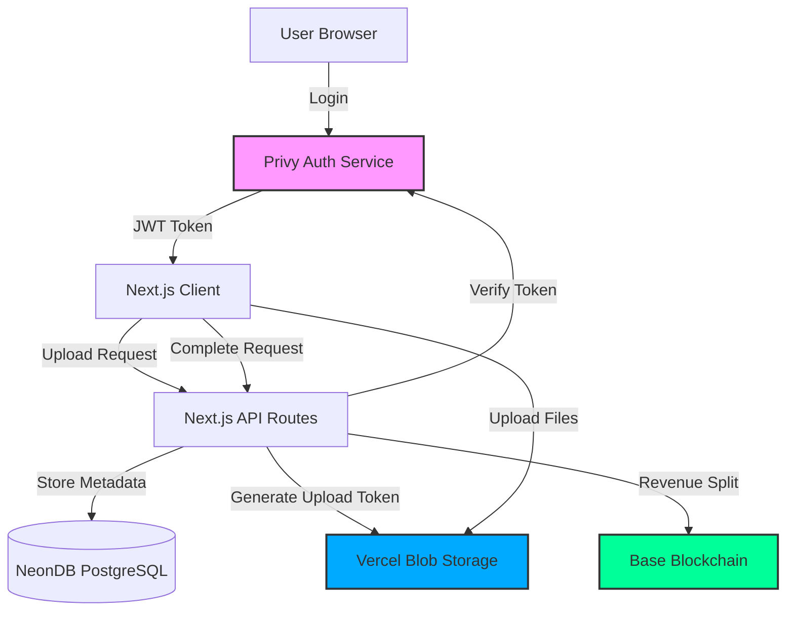
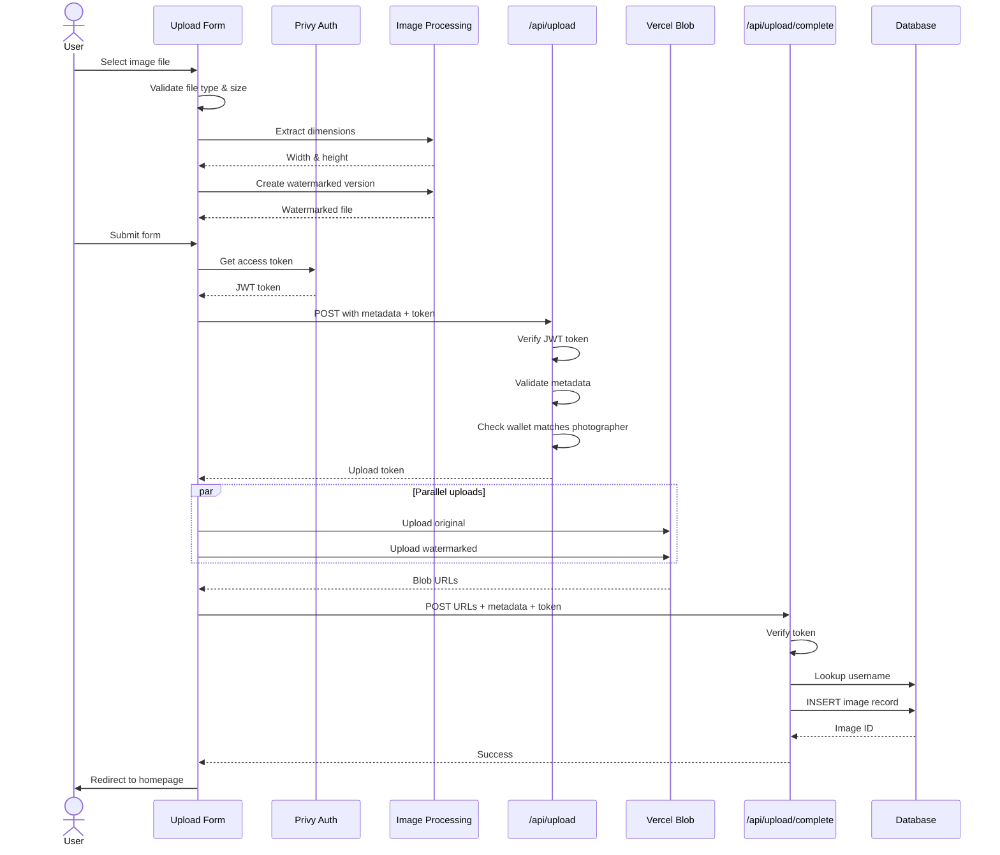
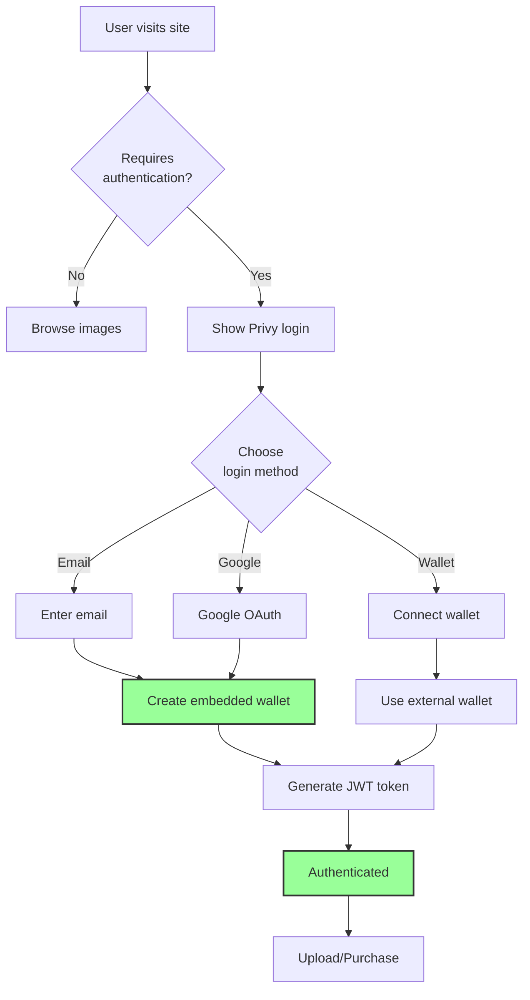
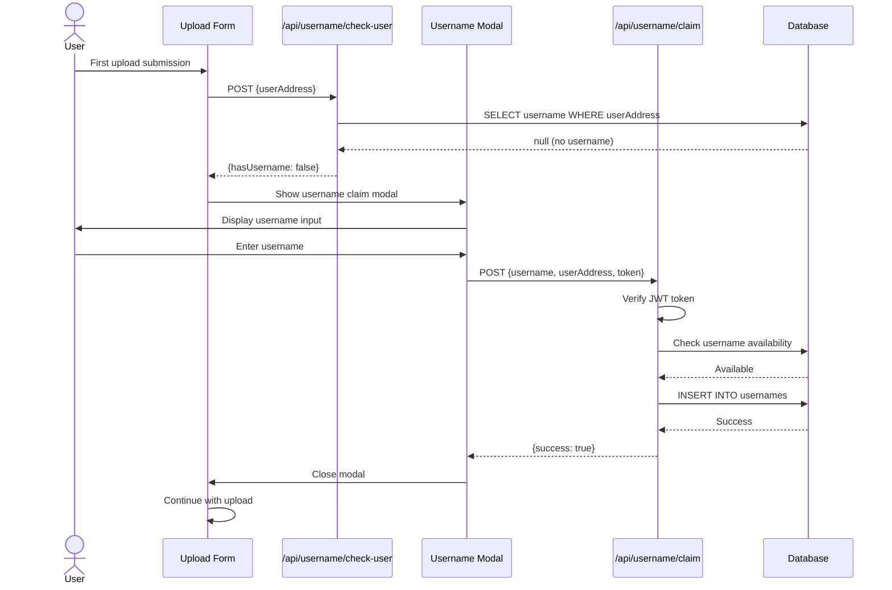
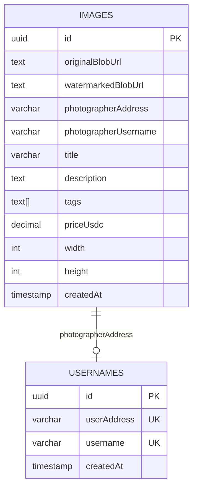

# Lens Llama

Pay-per-use stock photography platform with blockchain micropayments. Photographers upload images and earn 90% of sales through automated smart contract revenue splits.

## Overview

Lens Llama is a decentralized stock photography marketplace that combines:
- **Instant uploads** with client-side watermarking
- **Blockchain authentication** via Privy (email/Google/wallet)
- **Pay-per-download** with x402 micropayments on Base
- **90/10 revenue split** executed on-chain

### Key Features

- **Photographer-First**: 90% of every sale goes directly to photographers via smart contract
- **No Subscriptions**: Buyers pay only for images they need
- **Instant Access**: Watermarked previews available immediately, full resolution after payment
- **Web3 Made Easy**: Email/Google login creates embedded wallets automatically
- **Vercel Blob Storage**: Fast, reliable image hosting with global CDN

## Architecture



## Upload Flow



## Authentication Flow



## Username Claim Flow



## Data Model



## Tech Stack

### Frontend
- **Next.js 14** - React framework with App Router
- **TypeScript** - Type-safe development
- **Tailwind CSS** - Utility-first styling
- **Privy SDK** - Web3 authentication
- **Vercel Blob Client** - File upload SDK

### Backend
- **Next.js API Routes** - Serverless API endpoints
- **Drizzle ORM** - Type-safe database queries
- **Zod** - Runtime validation
- **Viem** - Ethereum interactions

### Infrastructure
- **Vercel** - Hosting and deployments
- **NeonDB** - Serverless PostgreSQL
- **Vercel Blob** - Object storage
- **Base** - L2 blockchain for payments

## Getting Started

### Prerequisites

- **Node.js** 18+ and **pnpm** 8+
- **PostgreSQL** database (NeonDB account recommended)
- **Vercel** account for Blob storage
- **Privy** account for authentication

### Installation

1. **Clone the repository**
   ```bash
   git clone https://github.com/emiliolanzalaco/lens-llama.git
   cd lens-llama
   ```

2. **Install dependencies**
   ```bash
   pnpm install
   ```

3. **Set up environment variables**

   Copy the example file and fill in your values:
   ```bash
   cp apps/web/.env.example apps/web/.env.local
   ```

   Required variables:
   ```bash
   # Database
   POSTGRES_URL=postgresql://...

   # Authentication (Privy)
   NEXT_PUBLIC_PRIVY_APP_ID=your-app-id
   PRIVY_APP_SECRET=your-secret

   # Storage (Vercel Blob)
   BLOB_READ_WRITE_TOKEN=your-token

   # Blockchain (Base)
   NEXT_PUBLIC_BASE_RPC_URL=https://mainnet.base.org

   # Optional: Revenue split contract
   NEXT_PUBLIC_REVENUE_DISTRIBUTOR_ADDRESS=0x...
   ```

4. **Run database migrations**
   ```bash
   pnpm db:push
   ```

5. **Start development server**
   ```bash
   pnpm dev
   ```

   Open [http://localhost:3000](http://localhost:3000)

## Project Structure

```
lens-llama/
├── apps/
│   ├── web/                    # Next.js application
│   │   ├── app/               # App router pages
│   │   │   ├── api/          # API routes
│   │   │   │   ├── upload/   # Upload endpoints
│   │   │   │   ├── username/ # Username endpoints
│   │   │   │   └── images/   # Image endpoints
│   │   │   ├── upload/       # Upload page
│   │   │   └── page.tsx      # Homepage
│   │   ├── components/        # React components
│   │   │   ├── ui/           # Shared UI components
│   │   │   ├── upload-form.tsx
│   │   │   └── image-card.tsx
│   │   └── lib/              # Utilities
│   │       ├── auth.ts       # Privy integration
│   │       ├── upload-validation.ts
│   │       └── client-image-processing.ts
│   └── facilitator/           # x402 payment facilitator (future)
├── packages/
│   ├── contracts/             # Smart contracts (Hardhat)
│   ├── database/             # Drizzle ORM schema
│   │   └── src/schema/       # Database tables
│   ├── config/               # Shared configs (ESLint, Prettier)
│   └── shared/               # Shared utilities
└── docs/                      # Documentation
    ├── TECHNICAL_SPEC.md
    ├── TASKS.md
    └── STYLE_GUIDE.md
```

## Development Commands

```bash
# Development
pnpm dev                       # Start dev server (all apps)
pnpm --filter web dev         # Start web app only
pnpm build                    # Build all packages
pnpm lint                     # Run ESLint
pnpm format                   # Run Prettier

# Testing
pnpm test                     # Run all tests
pnpm --filter web test        # Run web tests
pnpm --filter web test:unit   # Unit tests only

# Database
pnpm db:push                  # Push schema changes
pnpm db:studio                # Open Drizzle Studio
pnpm db:migrate               # Run migrations

# Contracts
pnpm --filter contracts compile    # Compile Solidity
pnpm --filter contracts test       # Run contract tests
pnpm --filter contracts deploy     # Deploy contracts
```

## Deployments

### Base Sepolia (Testnet)

| Contract | Address | Explorer |
|----------|---------|----------|
| RevenueDistributor | `0x9FBa4d8090E825d311982273D1bb77f5c46C9afa` | [View](https://sepolia.basescan.org/address/0x9FBa4d8090E825d311982273D1bb77f5c46C9afa#code) |

**Configuration:**
- USDC: `0x036CbD53842c5426634e7929541eC2318f3dCF7e`
- Treasury: `0xd08316c7c3bbe0f8d1ca9bf12bec3b351c737100`

### Production (Coming Soon)

- **Web App**: TBD
- **Base Mainnet**: Contracts not yet deployed

## Contributing

This is a hackathon/demo project. For major changes, please open an issue first to discuss what you would like to change.

## License

MIT

## Acknowledgments

- **Privy** for seamless Web3 authentication
- **Vercel** for hosting and Blob storage
- **Base** for fast, low-cost blockchain transactions
- **x402** protocol for HTTP payment flows
